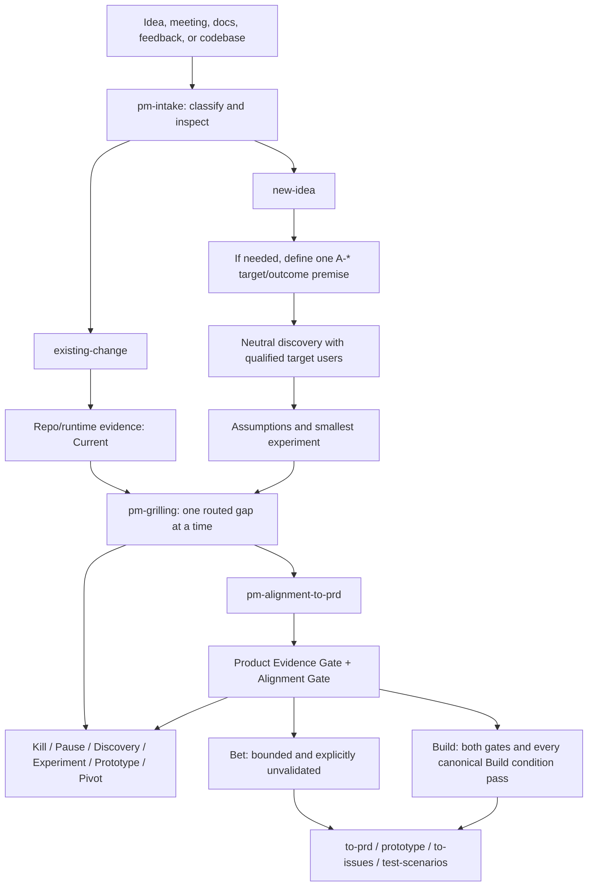

# WEN PM Skills

Default language: 简体中文

面向 AI agents 的证据驱动 PM discovery skills 套组。

这套流程服务两类最常见、也最容易浪费开发时间的工作：

- 已有产品或代码需要延伸、调整，或者实现完成后相关方仍认为“不是我想要的”。
- 只有一个模糊的新想法，需要用证据决定继续、转向、暂停还是杀掉。

使用者不需要先学会 PM 术语，也不需要记住 skill 菜单。把会议、想法、文档、截图、反馈或代码库交给 `pm-intake`；agent 负责查证、分类、逐问、记录证据和选择下一步。

## Quickstart

```bash
git clone https://github.com/cswfww123/wen-pm.git
cd wen-pm
./scripts/sync-skills.sh --dry-run
./scripts/sync-skills.sh
```

默认同步到：

- `agents` -> `~/.agents/skills`
- `codex` -> `~/.codex/skills`
- `claude` -> `~/.claude/skills`
- `zcode` -> `~/.zcode/skills`
- `kimi` -> `~/gstack/.kimi/skills`

只同步一个目标：

```bash
./scripts/sync-skills.sh --agents codex
```

脚本会拒绝覆盖没有 `.wen-pm-managed` 标记的同名 skill。确认要由本仓库接管时才使用：

```bash
./scripts/sync-skills.sh --force
```

## One Front Door

最常用的入口只有一个：

```text
/pm-intake
```

也可以直接用自然语言：

```text
这个功能已经开发了，但相关方说我完全没理解他的需求。仓库在……，这是他的反馈……
```

```text
我只有一个很模糊的想法：……。请先判断值不值得继续，不要直接帮我写 PRD。
```

`pm-intake` 会自动记录：

- `Discovery Track`: `existing-change | new-idea`
- `Interview Mode`: `decision-alignment | customer-discovery`
- 已检查和无法访问的证据来源
- 四风险状态
- 恰好一个 disposition 和下一步

如果同一个人既是目标用户又是决策者，通常先做不诱导的 customer discovery，再展示建议并进入 decision alignment。唯一例外是缺少的授权决定会改变目标人群或取证范围：先决定、立即重算 disposition，再做 discovery。两段内容不会混成一份“大家都同意”的假证据。

## Workflow



## Canonical Evidence Model

所有核心 skill 共享 [`evidence-model.md`](skills/pm-intake/references/evidence-model.md)，不在各自文件里重新发明“证据”的含义。

| ID | 类型 | 能证明什么 |
| --- | --- | --- |
| `EV-*` | Observed Fact | 在明确 Scope 内直接观察或测量到的行为、状态或结果 |
| `ST-*` | Stakeholder Statement | 某个人说过、要求过、回忆过或预测过什么 |
| `D-*` | Decision | 有权负责人在明确范围内授权、约束或停止了什么 |
| `A-*` | Assumption | 尚未验证、可以被证伪的产品主张 |
| `X-*` | Experiment Result | 按预先声明的成功、失败和无法判断阈值得到的实验结果 |

两条硬边界：

- 会议原话和正式决定可以证明意图与授权，不能证明用户价值。
- 代码、测试和日志可以证明当前实现与部分技术约束，不能证明正确需求、市场需求或业务价值。

证据必须同时记录 Claim、Source、Scope、Support 和 Strength。证据强度不会从一个人群、场景或结论自动外推到另一个。

## The Two Tracks

### Existing Change

已有产品和代码不是访谈的背景材料，而是首先要调查的现状证据。

```text
Current behavior
-> concrete rejection scenario
-> Expected behavior
-> smallest Delta
-> Keep / Change / Remove
-> business rules, edge/error flows, dependencies
-> migration and regression protection
-> business-readable acceptance examples
```

每个代码推导出的“隐含需求”仍是 `A-*`，直到它被独立证据支持或由正确负责人明确决定。最终交接保留：

```text
Evidence -> Decision -> Requirement -> Acceptance Criterion -> Test
```

### New Idea

新想法从问题和行为开始，不从功能清单开始。

```text
target segment and last real occurrence
-> current alternative and pain cost
-> search, switching, payment, or commitment behavior
-> load-bearing assumptions
-> highest-risk evidence gap
-> smallest experiment
-> success / kill / inconclusive result
```

实验成功只更新证据，不会自动授权 Build。下一项承重假设仍然必须可见。

## Interview Modes

### Decision Alignment

用于澄清意图、范围、规则、取舍和验收。可以向有权决策者展示：

- Observed evidence
- Candidate interpretation
- Recommendation
- 一个需要确认的决定

### Customer Discovery

用于了解真实用户的过去行为、现有替代方案和后果。一次只问一个中性问题，不展示推荐答案、候选方案或期望结论。

Marty Cagan 式锋利判断在访谈者后台运行；面对目标用户时保持非诱导。

## Dispositions

每个阶段只能选择一个：

- `Kill`: 杀死条件或硬约束已经满足。
- `Pause`: 有一个明确外部阻塞，且写明恢复条件。
- `Discovery`: 继续获取问题、行为、替代方案或价值证据。
- `Experiment`: 测一个承重假设。
- `Prototype`: 回答一个 usability 或 feasibility 问题。
- `Pivot`: 保留已证实机会，只替换一个被否定的核心前提。
- `Align`: 证据已经检查，但仍缺一个授权决定。
- `Bet`: 负责人明确接受证据缺口，并设定预算、期限、测量、回滚和杀死条件。
- `Build`: Product Evidence Gate、Alignment Gate 以及 canonical Build 的发布切片、测量、回滚等全部条件都通过。

`Bet` 不会被写成证据充分的 `Build`。这是为了允许现实组织做有限赌注，同时不让文档替赌注化妆。

## Core Outputs

- Intake classification and Evidence Ledger
- Existing Change Docket 或 New Idea Docket
- Clarified Terms and Decision Log
- Four Risks board
- Current / Expected / Delta and Keep / Change / Remove
- Assumption priority register
- Pre-registered experiment plan
- Product Evidence Gate and Alignment Gate
- Change Alignment Brief 或 Investment Alignment Brief
- Evidence-to-test traceability
- 本地 PRD 和 vertical-slice issue package

## Skills

### Core PM Flow

- [`pm-intake`](skills/pm-intake/SKILL.md): 唯一自动入口，查证并选择 track、mode、disposition 和下一步。
- [`pm-grilling`](skills/pm-grilling/SKILL.md): 一次处理一个最高风险缺口，支持 codebase-backed 返工访谈和新想法审判。
- [`pm-alignment-to-prd`](skills/pm-alignment-to-prd/SKILL.md): 分开审查产品证据与组织对齐，只为 Build 或显式 Bet 生成工程交接。
- [`marty-cagan`](skills/marty-cagan/SKILL.md): 证据案卷、四风险和直接产品判断。

### Discovery Inputs

- [`interview-script`](skills/interview-script/SKILL.md): 准备非诱导 customer-discovery 访谈。
- [`summarize-interview`](skills/summarize-interview/SKILL.md): 分开记录观察、原话、决定和假设影响。
- [`analyze-feature-requests`](skills/analyze-feature-requests/SKILL.md): 把功能请求还原为有证据的机会主题。

### Opportunities, Assumptions, And Experiments

- [`opportunity-solution-tree`](skills/opportunity-solution-tree/SKILL.md): 把 outcome、evidenced opportunity、替代方案和实验串起来。
- [`identify-assumptions-existing`](skills/identify-assumptions-existing/SKILL.md): 识别已有产品变更的四风险假设。
- [`identify-assumptions-new`](skills/identify-assumptions-new/SKILL.md): 识别新产品的八类承重假设。
- [`prioritize-assumptions`](skills/prioritize-assumptions/SKILL.md): 按 impact-if-false、uncertainty 和 test ease 选择先学什么。
- [`brainstorm-experiments-existing`](skills/brainstorm-experiments-existing/SKILL.md): 用现有行为、流量和代码设计最小实验。
- [`brainstorm-experiments-new`](skills/brainstorm-experiments-new/SKILL.md): 用真实承诺和行为设计新想法实验。
- [`strategy-red-team`](skills/strategy-red-team/SKILL.md): 攻击承重假设、定义杀死条件。

### Engineering Handoff

- [`to-prd`](skills/to-prd/SKILL.md): 从通过门禁的证据和决定生成本地可追踪 PRD。
- [`prototype`](skills/prototype/SKILL.md): 用一次性原型回答一个明确学习问题。
- [`to-issues`](skills/to-issues/SKILL.md): 把 PRD 拆成保留证据与验收 ID 的 vertical slices。
- [`test-scenarios`](skills/test-scenarios/SKILL.md): 把验收标准和受保护行为变成可追踪场景。

`to-prd` 和 `to-issues` 默认只写本地持久文件。只有用户明确要求时才发布到外部 issue tracker。

## Design Principles

- 用户负责提供真实经历、意图和授权决定；agent 负责先查所有可访问证据。
- Statements and Decisions are not product evidence.
- Current behavior is not intended behavior.
- Customer discovery is neutral; decision alignment may be opinionated.
- Every experiment pre-registers success, kill, and inconclusive outcomes.
- PRD records discovery; it never replaces discovery.
- Build needs evidence and alignment. Bet stays visibly a bet.
- One entry, one question, one disposition, one next action.

## Repository Layout

```text
README.md
scripts/
  sync-skills.sh
skills/
  pm-intake/
    SKILL.md
    references/evidence-model.md
  pm-grilling/
    SKILL.md
    references/existing-change.md
    references/new-idea.md
  pm-alignment-to-prd/
    SKILL.md
    references/existing-change.md
    references/new-idea.md
  ... supporting discovery and engineering skills
```

## Scope

当前专注于开发前 discovery、已有实现被否后的需求再发现，以及可追踪的工程交接。定价、GTM、增长和组织级 roadmap 不会为了“看起来完整”被塞进核心流程；真正需要时再增加对应证据流程。
