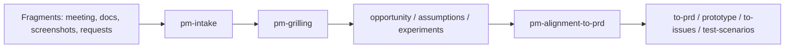

# WEN PM Skills

Default language: 简体中文

面向 AI agents 的 PM discovery skills 套组。

这个仓库用于把会议、聊天记录、粗文档、截图、功能请求等碎片输入，整理成可追问、可对齐、可交付给工程流程的 PM 产物。目标不是让 agent 变成填表机器，而是建立一座桥：

- 相关方、客户、用户真正需要什么
- 现有材料、访谈、数据能证明什么
- PM 应该继续追问、挑战、澄清什么
- 工程 agent 什么时候可以进入 PRD、prototype、issue、test plan

这套流程偏向小而可组合的 skills、证据案卷、一问一答的 grill、四风险判断、对齐确认文档，以及进入 Matt Pocock 风格工程流程前的清晰交接。

## Quickstart

安装到本机所有 agent skill 目录：

```bash
git clone https://github.com/cswfww123/wen-pm.git
cd wen-pm
./scripts/sync-skills.sh
```

默认目标目录：

- `agents` -> `~/.agents/skills`
- `codex` -> `~/.codex/skills`
- `claude` -> `~/.claude/skills`
- `zcode` -> `~/.zcode/skills`
- `kimi` -> `~/gstack/.kimi/skills`

如果只安装到一个 agent：

```bash
./scripts/sync-skills.sh --agents codex
```

如果目标目录已有同名 skill，先 dry-run：

```bash
./scripts/sync-skills.sh --dry-run
```

确认要让这个仓库接管同名 skill 后再覆盖：

```bash
./scripts/sync-skills.sh --force
```

最常用流程：

```text
/pm-intake             # 从会议纪要、文档、截图、聊天记录提取证据案卷
/pm-grilling           # 用 Marty Cagan 式 PM 判断逐问深挖
/pm-alignment-to-prd   # 产出可读回确认的对齐文档和工程输入
/to-prd | /prototype | /to-issues | /test-scenarios
```

## Workflow



1. **Intake**: 把碎片输入转成 docket，记录 claim、evidence、user/role、current alternative、outcome、risk、next question。
2. **Grill**: 一次只问一个最高风险问题。相关方请求是输入，不是证据。已有代码被否时，先从 codebase 提取当前实现隐含的需求，再围绕差异追问。
3. **Structure**: 用机会树、假设识别、风险排序和实验设计整理发现工作。
4. **Align**: 产出 Stakeholder Alignment Brief，拿回去逐条确认。
5. **Handoff**: 达成一致后进入 PRD、prototype、issues、test scenarios。

## Core Outputs

- Intake Docket
- Settled / Contradicted / Deferred notes
- Current Implementation docket, when code already exists
- Four Risks board: Value, Usability, Feasibility, Viability
- Opportunity Solution Tree
- Assumption map and Impact x Risk priority
- Experiment plan and kill criteria
- Stakeholder Alignment Brief
- PRD-ready summary
- Flow notes, acceptance criteria, prototype question, Matt handoff

## Why This Exists

### #1: Fragments Are Not Requirements

会议里的一句话、聊天里的一段意见、相关方口头说的功能点，都只是输入。PM 要把输入拆成证据、假设、风险和待确认问题。

### #2: PRD Cannot Replace Discovery

没有发现过程的 PRD 只是格式漂亮的赌注。真正的前置工作是确认谁受影响、现在怎么解决、有多痛、为什么值得做、什么证据会杀死这个想法。

### #3: Engineering Starts Too Early

开发流程需要明确输入。这里的 PM skills 负责在 `to-prd`、`prototype`、`to-issues` 之前，把问题、边界、流程、成功指标和风险讲清楚。

### #4: Alignment Needs A Read-Back Document

最终产物必须能拿回去给相关方、客户或用户逐条确认。确认稿要写出原始证据、PM 解读、需求复述、已确认决策、待确认问题、业务流程、范围、指标和风险。

## Skills

### Core PM Flow

- [`pm-intake`](skills/pm-intake/SKILL.md): 从会议、文档、截图、聊天记录和功能请求中提取 PM discovery docket。
- [`pm-grilling`](skills/pm-grilling/SKILL.md): 用 Marty Cagan 式 PM 视角一问一答深挖需求。
- [`pm-alignment-to-prd`](skills/pm-alignment-to-prd/SKILL.md): 把 settled docket 转成对齐确认稿和工程输入。
- [`marty-cagan`](skills/marty-cagan/SKILL.md): 资深 PM 审判视角，用证据案卷和四风险判断想法是否成立。

### Discovery Inputs

- [`interview-script`](skills/interview-script/SKILL.md): 准备客户访谈脚本，避免诱导式问题。
- [`summarize-interview`](skills/summarize-interview/SKILL.md): 把访谈记录整理成 JTBD、满意度信号和行动项。
- [`analyze-feature-requests`](skills/analyze-feature-requests/SKILL.md): 批量分析功能请求的主题、影响、成本和风险。

### Opportunities And Assumptions

- [`opportunity-solution-tree`](skills/opportunity-solution-tree/SKILL.md): 用 OST 把 outcome、opportunity、solution、experiment 串起来。
- [`identify-assumptions-existing`](skills/identify-assumptions-existing/SKILL.md): 识别已有产品功能想法的四类风险假设。
- [`identify-assumptions-new`](skills/identify-assumptions-new/SKILL.md): 识别新产品想法的市场、战略、团队等风险假设。
- [`prioritize-assumptions`](skills/prioritize-assumptions/SKILL.md): 用 Impact x Risk 排序假设并选择先测什么。
- [`brainstorm-experiments-existing`](skills/brainstorm-experiments-existing/SKILL.md): 为已有产品设计低成本验证实验。
- [`brainstorm-experiments-new`](skills/brainstorm-experiments-new/SKILL.md): 为新产品设计 pretotype、landing page、预购等验证。
- [`strategy-red-team`](skills/strategy-red-team/SKILL.md): 攻击 PRD、路线图和策略里的承重假设。

### Engineering Handoff

- [`to-prd`](skills/to-prd/SKILL.md): 把已对齐上下文转成 PRD。
- [`prototype`](skills/prototype/SKILL.md): 用一次性原型回答一个产品、逻辑、状态或 UI 问题。
- [`to-issues`](skills/to-issues/SKILL.md): 把 PRD 或计划拆成 vertical-slice issues。
- [`test-scenarios`](skills/test-scenarios/SKILL.md): 从用户故事和验收标准生成测试场景。

## Skill Design Principles

- Evidence before PRD.
- One question at a time.
- Stakeholder requests are input, not proof.
- Value, usability, feasibility, and viability must all be visible.
- Alignment documents must be readable back to the stakeholder.
- Use existing discovery skills before writing new ones.
- Keep skills small enough that agents still make judgment calls.
- Handoff to engineering only after scope, flow, metrics, and risks are explicit.

## Repository Layout

```text
README.md
skills/
  pm-intake/
    SKILL.md
  pm-grilling/
    SKILL.md
  pm-alignment-to-prd/
    SKILL.md
  marty-cagan/
    SKILL.md
    references/
    scripts/
  interview-script/
    SKILL.md
  summarize-interview/
    SKILL.md
  analyze-feature-requests/
    SKILL.md
  opportunity-solution-tree/
    SKILL.md
  identify-assumptions-existing/
    SKILL.md
  identify-assumptions-new/
    SKILL.md
  prioritize-assumptions/
    SKILL.md
  brainstorm-experiments-existing/
    SKILL.md
  brainstorm-experiments-new/
    SKILL.md
  strategy-red-team/
    SKILL.md
  to-prd/
    SKILL.md
  prototype/
    SKILL.md
  to-issues/
    SKILL.md
  test-scenarios/
    SKILL.md
```

## Current Focus

这个仓库当前专注于开发前 PM discovery：

- 从碎片输入建立证据案卷
- 在会议中持续 grill 直到共识足够清楚
- 把相关方对齐转成可确认的文档
- 在进入工程流程前明确范围、流程、指标、风险和待验证假设

后续可以补安装脚本、双语 README、更多行业模板，前提是这些东西开始真实降低重复工作。

## Contributing Skills

新增 skill 应该满足：

- 触发条件清楚
- 输出物明确
- 与现有 PM flow 有位置关系
- 不重复已有 skill 的职责
- 能把模糊输入推进到证据、判断或交付

优先新增能减少真实访谈和对齐成本的 skill。不要新增泛泛的最佳实践清单。

## Philosophy

真实 PM 工作不是把需求写漂亮，而是把未知变少：

```text
fragments -> evidence -> questions -> alignment -> PRD/prototype/issues
```

好的 PM skill 不替你判断现实。它逼你把现实问清楚。
